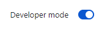
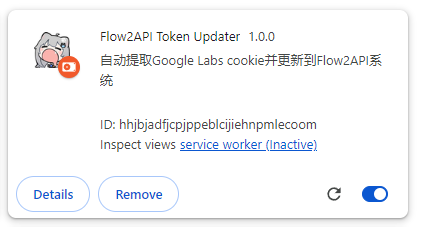
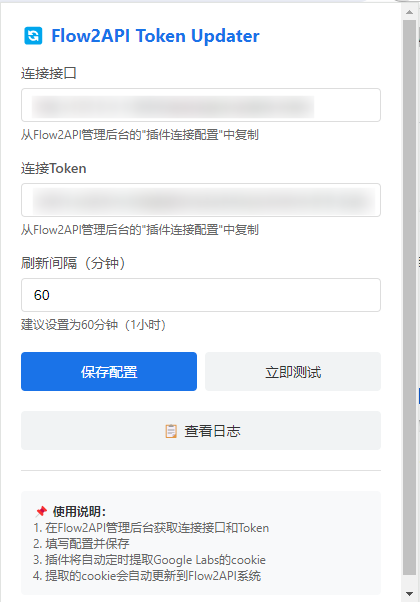
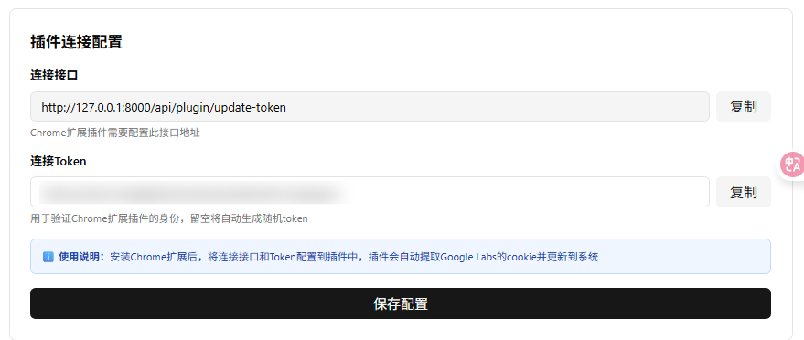

# Hướng dẫn sử dụng

Cần sử dụng kết hợp với dịch vụ [Flow2api](https://github.com/TheSmallHanCat/flow2api).

## I. Các bước cài đặt

1.  **Mở trang Tiện ích mở rộng (Extensions)**
    Nhập vào thanh địa chỉ của trình duyệt Chrome và truy cập:
    `chrome://extensions/`

2.  **Bật Chế độ dành cho nhà phát triển (Developer mode)**
    Nhấp vào công tắc **"Chế độ dành cho nhà phát triển"** ở góc trên cùng bên phải trang.
    

3.  **Tải tiện ích**
    Trực tiếp **kéo và thả** thư mục tiện ích đã giải nén vào trang trình duyệt, hoặc nhấp vào "Tải tiện ích đã giải nén" (Load unpacked) và chọn thư mục đó.
    

## II. Hướng dẫn cấu hình

1.  **Thiết lập API URL và Token**
    Nhấp vào biểu tượng tiện ích, trong cửa sổ hiện lên, hãy điền **Giao diện kết nối (API URL)** và **Token kết nối**. Thời gian (TTL) mặc định là 60 phút, khuyến nghị nên điền khoảng 6 giờ là đủ.
    

2.  **Lấy thông tin cấu hình**
    Nếu bạn không biết cách điền, vui lòng đăng nhập vào **trang quản trị (backend) của Flow2api** để xem địa chỉ API và khóa truy cập (Access Key) tương ứng.
    
